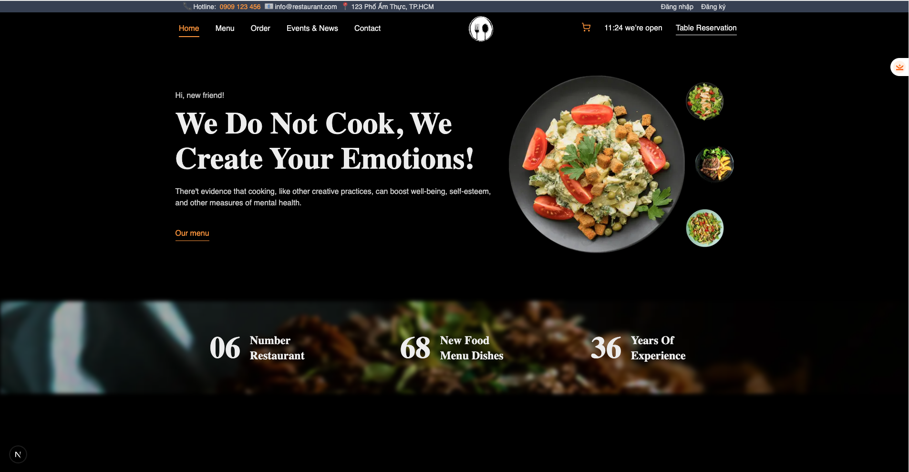

# 🍽️ Website Nhà Hàng - Restaurant Website

Một website giới thiệu nhà hàng và thực đơn, cho phép người dùng xem thông tin món ăn, blog chia sẻ, và đặt món online một cách dễ dàng.

---

## 📸 Demo

> [🌐 Xem demo tại đây](https://jzfzs9cq-3000.asse.devtunnels.ms)  
> 

## <!-- https://www.figma.com/design/wqot7j0yZt2rN4X2w3XCPd/16.-Multiple-Restaurant-Website-Theme?node-id=270-720&t=mXsFcnZbvh54R2xf-0 -->

## 🚀 Tính năng chính

-   🏠 Trang chủ với thông tin nổi bật về nhà hàng
-   📖 Xem thực đơn món ăn (Menu) và chi tiết món
-   📝 Trang blog chia sẻ kiến thức, mẹo vặt, món ăn(Soon ^^)
-   🛒 Trang đặt món: thêm món vào giỏ hàng, cập nhật số lượng
-   📋 Xem lại đơn hàng đã đặt
-   🔍 Tìm kiếm món ăn theo từ khóa hoặc loại món
-   📝 Form đặt bàn trước

---

## 🛠️ Công nghệ sử dụng

### Frontend:

-   NextJS + TypeScript
-   TailwindCSS
-   Redux toolkit
-   Framer Motion (animation)

### Backend (giả lập):

-   JSON Server
-   Các endpoint API: `/products`, `/subscribe`, `/orders`, `/blogPost`, `/login`,`/reservations`

---

---

## 📦 Cài đặt và chạy dự án

```bash
# Clone dự án
git clone https://github.com/HoainamLe42/restaurant-web.git
cd restaurant-website

# Cài đặt dependencies
npm install

# Chạy dự án ở môi trường phát triển
npm run dev

# Chạy json server
npm run server
```
